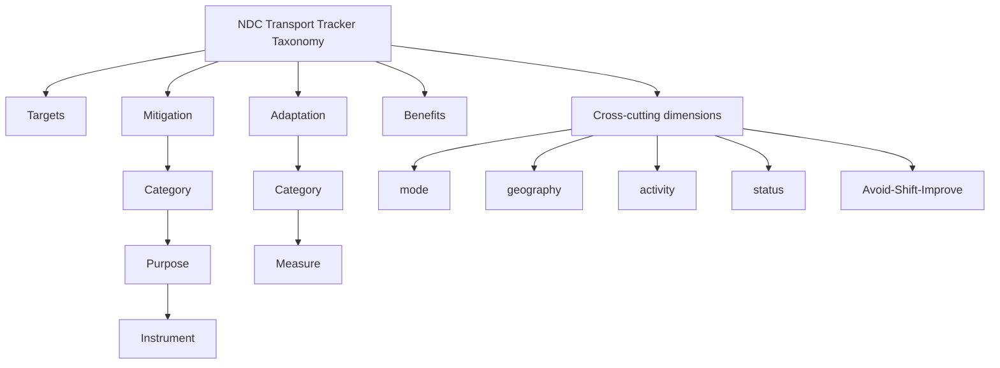

# NDC Transport Tracker — Taxonomy

**Version 4.0** · Last updated: May 2026 · License: [CC BY 4.0](https://creativecommons.org/licenses/by/4.0/)

> GIZ and SLOCAT (2025). NDC Transport Tracker (vers. 4.0). Available from: [changing-transport.org/tracker](https://changing-transport.org/tracker)

This folder contains the full classification taxonomy used by the NDC Transport Tracker database and the Transport Policy Miner pipeline. It is the authoritative reference for how transport-related commitments in NDCs and LTS documents are identified, extracted, and classified.

---

## What is the taxonomy?

Every target, measure, and benefit captured in the Tracker is classified using this taxonomy. It defines what counts as a transport commitment, how it is categorized, and what machine codes are used in the database.

The taxonomy has four **domains**:

| Domain | What it covers |
|---|---|
| **Targets** | Quantified goals — GHG reductions, mode share, ZEV uptake, etc. |
| **Mitigation** | Actions that reduce transport emissions (Category → Purpose → Instrument) |
| **Adaptation** | Actions that increase resilience to climate impacts (Category → Measure) |
| **Benefits** | Co-benefits explicitly linked to transport actions (air quality, health, access, etc.) |

In addition, **cross-cutting dimensions** (transport mode, geography, activity type, Avoid-Shift-Improve, implementation status) are tagged onto each mitigation and adaptation entry.

---

## Files in this folder

| File | Format | Use it when... |
|---|---|---|
| [`TAXONOMY.md`](./TAXONOMY.md) | Markdown with Mermaid diagrams | You want to browse the full taxonomy with visual hierarchy and all definitions |
| [`ndc_taxonomy.json`](./ndc_taxonomy.json) | JSON | You are feeding the taxonomy into code, an AI model, or a classification pipeline |
| [`ndc_taxonomy.csv`](./ndc_taxonomy.csv) | CSV | You want a flat table of all values, codes, and definitions for spreadsheet use |
| [`build/build_taxonomy.py`](./build/build_taxonomy.py) | Python script | You want to regenerate all three output files after updating the source workbook |
| [`build/NDC-taxonomy.xlsx`](./build/NDC-taxonomy.xlsx) | Excel workbook | The source of truth — edit this to update the taxonomy |

---

## Taxonomy structure



---

## How to update the taxonomy

1. Edit `build/NDC-taxonomy.xlsx` (the `Def_Targets` and `Def_Indicators` sheets are the canonical source)
2. Run the build script:
   ```bash
   cd build
   python3 build_taxonomy.py
   ```
3. The three output files (`TAXONOMY.md`, `ndc_taxonomy.json`, `ndc_taxonomy.csv`) will be regenerated automatically
4. Commit all changed files together

> Any changes to value names must also be reflected in the existing database entries — there is no automatism. See the note in `Def_Targets` sheet row 5.

---

## Definition policy

Definitions are taken verbatim from the source workbook. Where a clarified version is suggested (to correct typos or improve readability), it appears in the `definition_suggested` field in the JSON and CSV. The maintainer decides which version to adopt. Original definitions are never overwritten without a deliberate decision.

---

## Maintainers & contact

| Name | Organisation | Contact |
|---|---|---|
| María Belén Vásquez | GIZ | maria.vasquez1@giz.de |
| Nikola Medimorec | SLOCAT | nikola.medimorec@slocatpartnership.org |

Questions or corrections? Open an issue or reach out directly.
